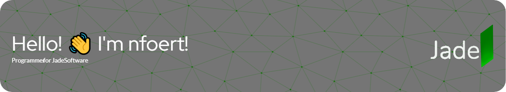

I'm a completely self-taught programmer in Python. I started my programming journey via [Scratch](https://scratch.mit.edu) and Java Script on [Khan Academy](https://www.khanacademy.org/computing/computer-programming/programming) I then moved on to [Code.org's App Lab](https://code.org/educate/applab) before introducing myself to [Python](https://www.python.org/) via a [Raspberry Pi](https://www.raspberrypi.com/). I soon moved on to Python on an actual computer and that's how Jade Software came about. I had an idea for a project and I kept working on it, learning a bunch of skills at the same time. I've been working with python for almost two years.

I learn by doing, but instead of doing multiple big projects I've just spent years on Jade Software and went at it at so many different angles from client side UI to frontend and backend web developemet.

I've also experimented with Swift, I learned CSS and HTML for the Jade Website and my blog, and I've done a bit of work with Unreal Engine 5.

(I also know enough markdown to make this README :smile:)

## Jade Software
Jade Software is a project I've spent two years on. It consists of the Jade Launcher that launches Jade Assistant which is as virtual assistant designed to help you in your day-to-day workflow.

Want to check out the Jade Launcher? [Download it here.](https://nfoert.pythonanywhere.com/jadesite)

<!--- --->
<!------>

Thanks to [Adafruit's great tutorial for making this repo look nice](https://learn.adafruit.com/excellent-github-profile)
