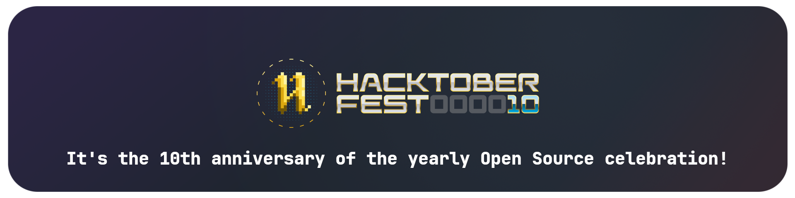

<hr>

<!-- [](https://hacktoberfest.com/)

<hr> -->
<br>

```python
class nfoert:
    def __init__(self):
        self.name = "nfoert"
        self.languages = ["Python", "HTML", "CSS", "JavaScript", "C++"]
        self.portfolio = "https://nfoert.github.io"

        self.projects = {
            "Cardie": "github.com/nfoert/cardie",
            "Circles": "github.com/nfoert/circles",
            "Jade Software": "github.com/nfoert/jadelauncher",
            "And more...": "github.com/nfoert"
        }

        self.links = {
            "YouTube": "youtube.com/@nfoert",
            "Twitch": "twitch.tv/nfoert",
            "Discord": "nfoert"
        }
    
    def hello(name):
        print(f"Hello, {name}. I'm nfoert!")
  
```

<h1>Hello there! 👋</h1>
<p>
I'm <b>nfoert</b>, a programmer from USA. I care a lot about open source software, self hosting, and right to repair. I enjoy tinkering and experimenting with different aspects of technology, and I'm learning to create applications that have a helpful and functional use to the open source community.

So far, I've mostly learned higher-level languages like Python and JavaScript, but I'd like to spend some time soon to learn languages like Rust or C++.

I've also experimented with Unreal Engine 5, created a macro pad with a Raspberry Pi Pico, I self host a personal Minecraft server, photo storage solution, Home Assistant, and I do other fun tinkery things.
</p>
<hr>
<br>
<p align="center">
  <a href="https://skillicons.dev">
    
  </a>
</p>
<hr>
<br>

[](https://holopin.io/@nfoert)


[](https://git.io/streak-stats)
[](https://github.com/anuraghazra/github-readme-stats)

<hr>

<!-- Thanks to Hacktoberfest for the [assets](https://hacktoberfest.com/_next/static/media/event-kit.c62668ad.zip). -->


